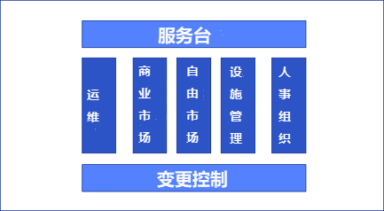
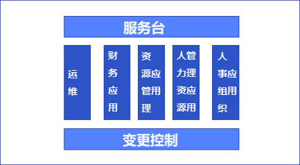
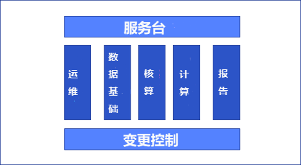

# 4 组织模式

## 4.1 介绍
本章描述了几种DevOps团队的组织模式。

## 4.2 术语
**服务台**
服务台是客户和服务供应商之间的单一联系点(SPOC)。二者之间主要的沟通内容包括问题，服务请求，事故，特性请求和投诉。服务台对于DevOps团队尤为重要，因为它使得DevOps团队可以专注于他们的流程。

**变更控制**
在每一个DevOps团队内都存在着某种形式的关卡，用来接受和推进一个产品特性。这种控制被统称为“变更控制”。它可以通过不同途径实现，比如产品负责人，守门人，变更咨询委员会（CAB）。根据变更风险和产品特性影响范围，一个DevOps团队有可能选择不同的“变更控制”方式。

**特性垂直拆分**
理想的情况下，一个DevOps团队是有能力自主实现一个产品特性的。这意味着他们的工作不需要依赖于其他DevOps团队或者其他组织单位，如基础架构部门。其优点是，这个团队和其他团队之间只会有很少的沟通和依赖。其缺点是，这个团队必须拥有足够宽泛的的知识储备和专业技术。

**特性水平拆分**
在某些服务组织中，专业的DevOps团队只负责实现产品特性请求的一部分。在这种情况下，需要更多的DevOps团队协作来完成并发布一个产品特性。其优点是，这些团队对所使用的产品有深入的了解并且能够交付高质量产品。其缺点是，几乎每个产品特性都需要两个以上团队协作完成。

**模式**
模式是针对某个通用问题或反复出现问题的通用解决方案。一个DevOps团队可以通过分析他们遇到的问题以及解决问题的方法，从而总结出模式，并通过叙事分享给其他的DevOps团队。本章将介绍组建DevOps团队的几种模式。

## 4.3  概念
**特性拆分**
在DevOps团队中有两种方法来拆分产品特性，即垂直特性分割和水平特性分割。垂直分割特性意味着由一个DevOps团队来处理一个产品特性。水平分割意味着需要多个DevOps团队共同来实现一个产品特性。

一般来说，我们首选垂直分割，因为这只需要较少的团队间交互。然而，这并不是总能实现，比如应用程序与/或基础架构过于复杂。本章将会提及每个模式所使用的特性分割方法。

## 4.4 模式
在组建DevOps团队时，有几种不同的模式需要分清。每种模式都有它的优点和缺点。本章讨论的三种模式为：
*  业务线模式。这种模式下所有DevOps团队都来自同一条业务线。
*  项目组合模式。这种模式基于应用程序组合中的各个应用来划分DevOps团队的工作。
*  信息价值链模式。这个模式特别适用于把[信息池][1]转译成报告的信息提供者。

这三种模式都使用了服务台和变更控制。但每种模式的垂直或水平分割方法是不同的。采用不同模式对DevOps团队的绩效及其工作质量都会产生很大影响。

### 4.4.1 业务线模式
业务线模式是按照应用程序来划分DevOps团队，而所有的应用程序又被分割到不同的业务线中。在各个DevOps团队中的交互为零。因此这是一种垂直特性分割。

图4‑1, 业务线模式

在这种模式下，服务台是顾客和服务供应商之间的单一联系点。运维团队负责监控服务。变更控制作为控制单元，负责将不同特性分配到不同Devops团队中直到发布。然而，这个模式下的变更控制是轻量级的，因为各个DevOps团队负责的产品特性的交集很小。

这些业务线包括：
*  瞄准企业的商业市场；
*  瞄准自然人的自由市场;
*  在设备，停车场，餐馆及其他服务领域中提供服务的设备公司。

### 4.4.2 组合模式
最后一种常用的模式是面向投资组合的。在这种组织形式中，团队聚合在一起服务于一组相互关联紧密的应用程序集合。同样，这种模式也是基于垂直特性分割。

图4‑2, 组合模式

这些通用的DevOps团队（服务台，运维，变更控制）与业务线模式相同。应用程序集群的例子是财务应用服务，资源管理应用，人力资源应用和人事&组织应用。

### 4.4.3 信息价值链模式  
信息价值链模式试图通过一组相互协作的团队来提供顾客信息服务。这就意味着DevOps报告团队想要设计一个新报告，需要最少一个最多五个DevOps团队的参与。因此，这是一个水平特性分割（参见特性分割章节）。

图4‑3, 信息价值链模式

在这个模式中，服务台是顾客和服务供应商之间的单一联系点。运维团队负责监控信息服务。基础数据团队负责收集信息文件。核算团队负责管理信息文件的处理流程及质量审计。运算团队负责执行报告中需要的数据计算。报告团队负责将计算好的数据提供给客户，报告形式包括数据市场，报告模版及应急报告。变更控制是作为控制单元，负责将不同特性分配到不同Devops团队中直到发布。

选择这种模式的原因是，像创建报告这种情况下，所需要用到的知识和专门技术太广泛。人们也可以改变这种模式，根据报告内容来为DevOps团队分组。然而，这就需要一个DevOps团队必须能够完成数据收集，数据核算，数据计算和数据报告的全部任务。并且导致当各个团队工作于相同的应用程序和信息对象时，团队之间就会相互影响。

## 4.5 常见问题（FAQ）

| **#** | **分类** | **问题**                              | **答案**                                                 |
| ----- | ---------------- | ------------------------------------------ | ------------------------------------------------------------ |
| 1     | 选择             | 有更多的模式么？                       | 肯定会有更多的模式。一旦他们被识别，将会被添加到本章节中 |
| 2     | 延迟             | 一个外部变更控制会使DevOps团队速度变慢么？ | 的确。无论什么情况下，如果可能，都应该在及其需要时才引入控制。 |
表4‑1, FAQ – 组织模式

[1]: 原著用了information lake
