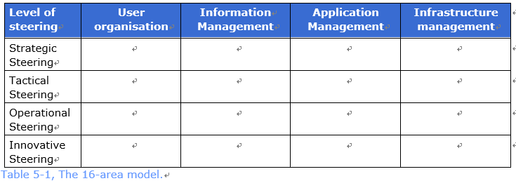
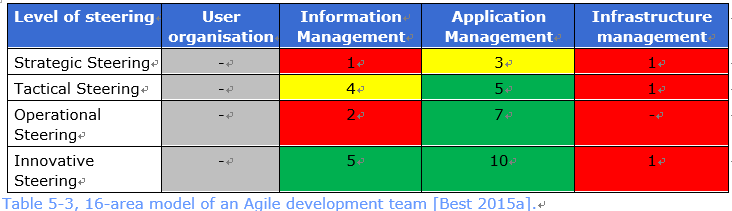
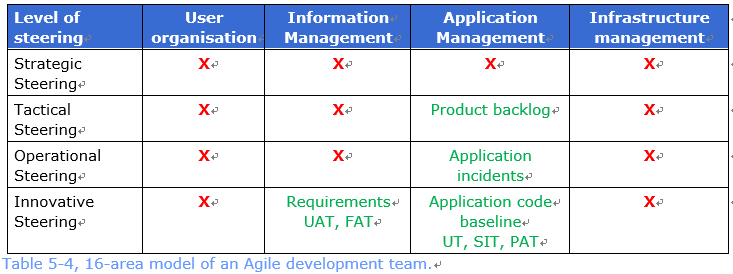
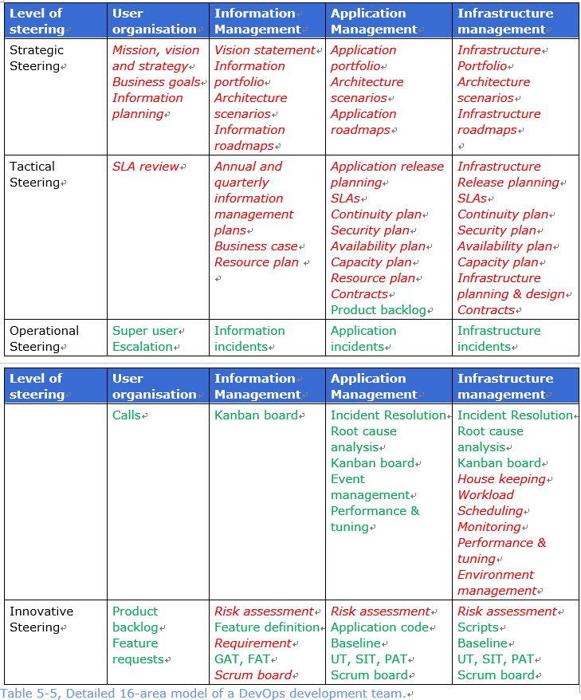

# 5 流程蓝图（＃04）

## 5.1 介绍

本文描述了一种体系结构模型，**以在基于DevOps的服务组织中实现服务管理流程的平衡设计**。*以实现基于 DevOps 服务组织中服务管理流程的平衡设计*

## 5.2 术语

### 体系结构模型

现实的简化表示。

## 5.3 概念

### 流程蓝图

流程蓝图是体系结构模型的一个例子。蓝图在一张图中显示了在服务组织中使用**哪种** *哪些* 服务管理流程，以及如何组织纵向和横向治理，而没有详细显示所有**通信线路** *沟通路线*。

| 指导层面 | 用户组织 | 信息管理 | 应用管理 | 基础架构管理 |
|:--------|:--------|:--------|:--------|:-----------|
| 战略指导 |         |         |         |            |
| 战术指导 |         |         |         |            |
| 运营指导 |         |         |         |            |
| 创新指导 |         |         |         |            |
表5-1 16区域模型

表5-1展示了16区域服务管理模型。如果这个模型是通过 DevOps 流程完成的，那么对于每个组织来说都是非常有启发性的。如果流程没有被明确识别，那么也可以用可交付成果来完成16区域模型。
为了简单明了起见，本文只说明可交付成果。 **而且， DevOps 团队当然可以包含多个单元格 **。*另外，DevOps团队当然也可以在单元格中加入更多*。

这种管理模式的优势在于，**它可以帮助您思考 DevOps 领域的内容是什么不是什么** *它可以帮助您思考什么在和什么不在 DevOps 领域*。**只要 DevOps 区域中排除了某些内容，就是涵盖此交付内容的问题** *一旦什么被排除到 DevOps 区域之外，那交付成果涉及的问题就来了*。

## 5.4 模式

本文讨论了16区域服务管理模型的一些特征完成。该**规划** *formulation* 是指示性的而不是限制性的，因此可能有许多额外的补充。这些示例的目的是阐明如何在 DevOps 团队内部实现“控制”的选择。另外，通过识别和接受来明确地**把握** *take distance of* 具体的控制方面是非常重要的。

### 5.4.1 **经典** *传统* 服务组织模式

在传统的服务组织中，管理模型的每个单元格通常都会被填入。**通常，使用BiSL和ITIL过程的可交付成果** *一般 BiSL 和 ITIL 流程的交付成果会被用到*。
表5-2显示了一个示例条目。

| 指导层面    | 用户组织                                | 信息管理                                                              | 应用管理                                                                                     | 基础架构管理                                                                                                      |
|:-----------|:---------------------------------------|:--------------------------------------------------------------------|:--------------------------------------------------------------------------------------------|:----------------------------------------------------------------------------------------------------------------|
| 战略指导    | 使命，愿景和战略 业务目标 信息规划 | 信息[^集] 体系结构场景 信息路线图       | 应用集 体系结构场景 应用路线图                                                          | 基础架构 项目集 体系结构场景 基础架构路线图                                                               |
| 战术指导    | SLA 评审                                | 年度和季度信息管理[^计划] 业务案例 资源计划 财务计划           | 应用发布计划  SLAs  安全计划 持续计划 可用性计划 容量计划 资源计划 合同 | 基础设施 发布计划 SLAs 安全计划  **连续性** *持续性*计划 可用性计划 容量计划 基础架构 规划和设计 合同 |
| [^运营指导] | 超级用户 升级 呼叫               | 信息事件                                                           | 应用事件 事件  **解析度** *解决方案* 根本原因分析 事项`event`管理 性能&**调整** *调优* | 基础设施事件 事件  **解析度** *解决方案* 根本原因分析 [^机房管理] 工作量 调度 监控 性能&**调整** *调优* 环境管理 |
| 创新指导    | 请求变更（RFC）                          | 风险评估 RFC日历 需求 用户验收测试（UAT），功能验收测试（FAT） | 风险评估 应用代码 基线 单元测试（UT），系统集成测试（SIT），产品验收测试（PAT）           | 风险评估 脚本 基线 UT，SIT，PAT                                                                        |

表5-2 经典服务组织的16区域模型

### 5.4.2 敏捷开发团队模式

**荷兰十个组织的研究[Best 2015a]指出** *通过对荷兰十个组织的调研表明*，使用敏捷方法的服务组织中仍然存在服务管理流程。表5-3显示了十个组织分配给敏捷开发团队的范围。灰色意味着没有涉及，**但也没有真正的预期期望** *也没有确切的期望*。 红色意味着`几乎`不涉及。黄色意味着部分涉及,绿色意味着涉及。这些数字反映了实施某一/方面/`相关`领域的十个组织的数量。特别是对信息管理的**重视程度不够** *忽视* 令人担忧。 而且，大多数战略框架的缺乏是显而易见的。

| 指导层面 | 用户组织 | 信息管理 | 应用管理 | 基础架构管理 |
| :------: | :------: | :------: | :------: | :----------: |
| 战略指导 |    -     |    1     |    3     |      1       |
| 战术指导 |    -     |    4     |    5     |      1       |
| 运营指导 |    -     |    2     |    7     |      -       |
| 创新指导 |    -     |    5     |    10    |      1       |

表 5-3，敏捷开发团队16区域模型[Best 2015a].    

表 5-4 展示了可能被这些组织所期望的交付物示例 [Best 2015a]。对于这些组织来说，一个重要问题是管理架构的指示（服务战略）和规划（服务设计）的其他单元必须要实现什么。

| 指导层面 | 用户组织 |   信息管理    |         应用管理          | 基础架构管理 |
| :------: | :------: | :-----------: | :-----------------------: | :----------: |
| 战略指导 |    X     |       X       |             X             |      X       |
| 战术指导 |    X     |       X       |       产品待办列表        |      X       |
| 运营指导 |    X     |       X       |         应用事件          |      X       |
| 创新指导 |    X     | 需求 UAT, FAT | 应用代码基线 UT, SIT, PAT |      X       |

表 5-4，敏捷开发团队16区域模型

### 5.4.3 DevOps团队的模式

类比典型管理组织和敏捷开发团队的模式，看看DevOps组织期望什么显然很有趣。在表 5-5 中，一个组织上可能的实现阐明了那正好采用的是DevOps方法。在这种情况下，它是一个业务上的DevOps团队，因为信息管理的在其范围内。完成是基于DevOps团队自身实际做了什么以及直系组织覆盖了哪些。

| 指导层面 |              用户组织              |                  信息管理                  | 应用管理                                                     |                         基础架构管理                         |
| :------: | :--------------------------------: | :----------------------------------------: | ------------------------------------------------------------ | :----------------------------------------------------------: |
| 战略指导 | 使命、愿景和战略 商业目标 信息规划 |   愿景声明 信息集 架构场景 信息路线图    | 应用集 架构场景 应用路线图                                 |             基础架构 项目集 架构场景 基础架构路线图             |
| 战术指导 |              SLA 评审              | 年度和季度信息管理规划 商业案例 资源计划 | 应用发布计划 SLAs 持续性计划 安全性计划 可用性计划 容量计划 资源计划 合同 产品待办事项列表 | 基础架构发布计划 SLAs 持续性计划 安全性计划 可用性计划 容量计划 基础架构规划和设计 合同 |
| 运营指导 |       超级用户 上报升级 呼叫       |               信息事件 看板                | 应用事件 事项解决方案 根本原因分析 事件管理 性能调优         | 基础架构事件 事件解决方案 根本原因分析 看板 机房管理 工作负载 调度 监控 性能调优 环境管理 |
| 创新指导 |   产品待办事项列表 特性需求列表    |   风险评估 特性定义 需求 GAT FAT Scrum板   | 风险评估 应用代码 基线 UT, SIT, PAT Scrum板                   |            风险评估 脚本 基线 UT, SIT, PAT Scrum板            |

表 5-5，详细的DevOps团队开发16区域模型

表 5-5 中，没有被使用的交付物用红色来显示。这种情况下关心的是架构、规划和控制方面的交付物。绿色术语相关方面是在 DevOps 里设计的。这个结果对初创的 DevOps 组织来说非常普遍，部分原因是一个 DevOps 团队常常是从开发和维护一个网站开始的，因此似乎不太需要指示（架构）和控制（规划）。后面的时间通常会出现后台需要的一些接口，一旦这些被开发出来了，在特定的压力下，会呈现需要更多的控制和指示的情况。

## 5.5 FAQ

表 5-6 中包含了流程蓝图相关的 FAQ

| #    | 主题         | 问题                                            | 解答                                                         |
| ---- | ------------ | ----------------------------------------------- | ------------------------------------------------------------ |
| 1    | 覆盖范围     | 理想的 DevOps 范围是什么？                      | DevOps 理应涵盖一个服务的全生命周期，无论是在信息、应用还是基础架构管理等方面。任何情况下，与 DevOps 团队主题里的运营和创新层面是要被包含的。对于战术和战略流程，通常会选择多个 DevOps 团队的集中来实现。这很重要，无论如何，指示（战略）和规划（战术）和 DevOps 团队的工作非常贴近。安全架构和 SLA 标准就是一个例子。 |
| 2    | 基础架构范畴 | DevOps 团队通常拥有基础架构管理的全部控制权吗？ | 很多组织将基础架构管理分成一个通用层并将 DevOps 团队划分在该层之上。这些 DevOps 团队在一定范围内能够为他们自己的基础架构编写程序（基础架构即代码）。 |

表5‑6, FAQ – 流程蓝图

[^运营指导]: Operational-Steering，可能是运维但感觉运营的含义更丰富，更适用于战略角度的描述
[^计划]: plan
[^规划]: planning
[^机房管理]: House-keeping，在基础设施的那一列，所以应该是相关房间的管理及一些日常巡检之类的工作
[^集]: portfolio，应该是项目集的意思（比项目组合更高），单独出现时翻译为项目集，前面有定语的情况下翻译为集
[^特征完成]: characteristic completions
[^解决方案]: resolution
[^沟通路线]: communictation line
[^评审]: review
[^发布计划]: release planning
[^后果]: consequences
[^传统的]: classic
[^体系结构场景]: Architecture scenarios

