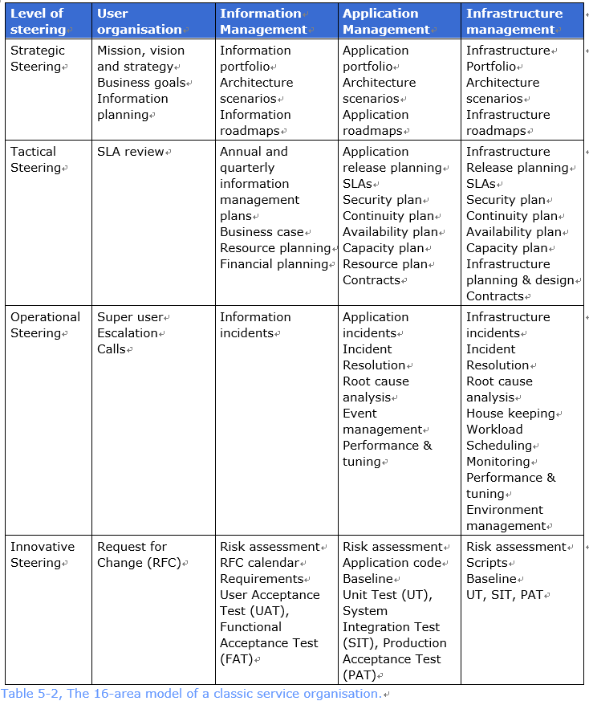

# 5 流程蓝图（＃04）

## 5.1 介绍

本章描述了一种体系结构模型，用它来在以 DevOps 为基础的服务组织中，实现服务管理流程的平衡设计。

## 5.2 术语

### 体系结构模型

对现实情况的简化呈现。

## 5.3 概念

### 流程蓝图

流程蓝图是体系结构模型的一个例子。蓝图用一张图示显示了在服务组织中使用哪些服务管理流程，以及在没有详细显示所有沟通路线的情况下，如何组织纵向和横向治理。

| 指导层面 | 用户组织 | 信息管理 | 应用管理 | 基础架构管理 |
|:--------|:--------|:--------|:--------|:-----------|
| 战略指导 |         |         |         |            |
| 战术指导 |         |         |         |            |
| 运营指导 |         |         |         |            |
| 创新指导 |         |         |         |            |

表5-1 16区域模型

表5-1展示了一个16区域的服务管理模型。如果这个模型是通过 DevOps 流程完成的，那么对于每个组织来说都是非常有启发性的。如果流程没有被明确识别，那么也可以用可交付成果来完善这个16区域模型。为了简单明了起见，本文只阐明可交付成果。另外， DevOps 团队当然也可以在单元格中加入更多。

这种管理模式的优势在于，它可以帮助您思考 DevOps 领域内有什么和没有什么。一旦有些内容被排除到 DevOps 区域之外，那么，可交付成果涉及被隐藏在哪里的问题就出来了。

## 5.4 模式

本章讨论了16区域服务管理模型的一些典型的完善方法。这些公式化的过程是被揭示性陈述的而不是提出限定条件的，因此，对它们可能还会有许多额外的补充。这些示例的目的，是阐明如何进行选择，才能够达到什么样的"控制"是被应用到了 DevOps 团队中。另外，重要的是，要在对衔接着的流程的逐步认知和接受中，来明确地把握具体的控制的诸方面。

### 5.4.1 传统服务组织模式

在传统的服务组织中，管理模型的每个单元格通常都会被填入，在通常情况下，被使用的是 BiSL 和 ITIL 流程的可交付成果。表5-2显示了一个示例。

| 指导层面    | 用户组织                                | 信息管理                                                              | 应用管理                                                                                     | 基础架构管理                                                                                                        |
|:-----------|:---------------------------------------|:--------------------------------------------------------------------|:--------------------------------------------------------------------------------------------|:------------------------------------------------------------------------------------------------------------------|
| 战略指导    | 使命，愿景和战略 业务目标 信息规划 | 信息[^集] 体系结构场景 信息路线图                               | 应用集 体系结构场景 应用路线图                                                          | 基础架构 项目集 体系结构场景 基础架构路线图                                                                 |
| 战术指导    | SLA 评审                                | 年度和季度信息管理[^计划] 业务案例 资源计划 财务计划           | 应用发布计划  SLAs  安全计划 持续计划 可用性计划 容量计划 资源计划 合同 | 基础设施 发布计划 SLAs 安全计划 持续性计划 可用性计划 容量计划 基础架构 规划和设计 合同 |
| [^运营指导] | 超级用户 升级 呼叫               | 信息事件                                                              | 应用事件 事件 解决方案 根本原因分析 事项`event`管理 性能&调优                  | 基础设施事件 事件 解决方案 根本原因分析 [^机房管理] 工作量 调度 监控 性能&调优 环境管理 |
| 创新指导    | 请求变更（RFC）                          | 风险评估 RFC日历 需求 用户验收测试（UAT），功能验收测试（FAT） | 风险评估 应用代码 基线 单元测试（UT），系统集成测试（SIT），产品验收测试（PAT）           | 风险评估 脚本 基线 UT，SIT，PAT                                                                          |

表5-2 经典服务组织的16区域模型

### 5.4.2 敏捷开发团队模式

通过对荷兰十个组织的调研[Best 2015a]表明，在使用敏捷方法的服务组织中，仍然一直在使用服务管理流程。表5-3显示了这十个组织分配给敏捷开发团队的工作范围。灰色单元格表示没有涉及，因此也就不会真正的预期。红色单元格表示几乎不涉及。黄色单元格表示部分涉及,而绿色单元格表示涉及。单元格中的这些数字反映出这十个组织中实践敏捷方法的方面领域的数量。特别是，对信息管理的忽视很令人担忧。从而也可以看出，它们在战略框架的大多数方面的缺乏是十分惊人的。

| 指导层面 | 用户组织 | 信息管理 | 应用管理 | 基础架构管理 |
|:-------:|:-------:|:-------:|:-------:|:----------:|
| 战略指导 |    -    |    1    |    3    |     1      |
| 战术指导 |    -    |    4    |    5    |     1      |
| 运营指导 |    -    |    2    |    7    |     -      |
| 创新指导 |    -    |    5    |   10    |     1      |

表 5-3，敏捷开发团队16区域模型[Best 2015a].

表 5-4 显示的是可能被这些组织所期望的可交付成果示例[Best 2015a]。对于这些组织来说，一个重要问题是：管理架构的指令（服务战略）和规划（服务设计）的其他单元而言，什么是必须要被实现的。

| 指导层面 | 用户组织 |   信息管理    |         应用管理          | 基础架构管理 |
|:-------:|:-------:|:------------:|:------------------------:|:----------:|
| 战略指导 |    X    |      X       |            X             |     X      |
| 战术指导 |    X    |      X       |       产品待办列表        |     X      |
| 运营指导 |    X    |      X       |         应用事件          |     X      |
| 创新指导 |    X    | 需求 UAT, FAT | 应用代码基线 UT, SIT, PAT |     X      |

表 5-4，敏捷开发团队16区域模型

### 5.4.3 DevOps 团队的模式

除了传统管理组织模式和敏捷开发团队模式以外，(我们)更乐于看到 DevOps 组织的期望。在表 5-5中，一个组织上可能的实现阐明了，那正好采用的是 DevOps 方法。在这种情况下，它是一个业务 DevOps 团队，因为信息管理在其范围内。这种完善，是基于 DevOps 团队本身的实际工作，而且是被线性所涵盖的。

| 指导层面 |                用户组织                 |                         信息管理                          | 应用管理                                                                                                          |                                                     基础架构管理                                                     |
|:-------:|:--------------------------------------:|:-------------------------------------------------------:|:----------------------------------------------------------------------------------------------------------------|:------------------------------------------------------------------------------------------------------------------:|
| 战略指导 | 使命、愿景和战略 商业目标 信息规划 |       愿景声明 信息集 架构场景 信息路线图        | 应用集 架构场景 应用路线图                                                                                  |                                   基础架构 项目集 架构场景 基础架构路线图                                   |
| 战术指导 |                SLA 评审                 |       年度和季度信息管理规划 商业案例 资源计划        | 应用发布计划 SLAs 持续性计划 安全性计划 可用性计划 容量计划 资源计划 合同 产品待办事项列表 |     基础架构发布计划 SLAs 持续性计划 安全性计划 可用性计划 容量计划 基础架构规划和设计 合同      |
| 运营指导 |        超级用户 升级 呼叫        |                     信息事件 看板                     | 应用事件 事项解决方案 根本原因分析 事件管理 性能调优                                                   | 基础架构事件 事件解决方案 根本原因分析 看板 机房管理 工作负载 调度 监控 性能调优 环境管理 |
| 创新指导 |     产品待办事项列表 特性需求列表      | 风险评估 特性定义 需求 GAT FAT Scrum板 | 风险评估 应用代码 基线 UT, SIT, PAT Scrum板                                                        |                                风险评估 脚本 基线 UT, SIT, PAT Scrum板                                |

表 5-5，详细的DevOps团队开发16区域模型

在表 5-5中，没有被使用的可交付成果用红色字体标出。在这里，涉及的是架构方面、规划方面和控制方面的可交付成果。绿色字体标出术语，与 DevOps 中设计的方面有关。这个结果对起步阶段的 DevOps 组织来说是非常普遍的。部分原因是一个 DevOps 团队常常是从开发和维护一个网站开始的，因此，似乎不太需要指向（架构）和控制（规划）。随后通常会出现后台需要的一些接口，一旦这些被开发出来了，在特定的压力下，会出现需要更多的控制和指示的情况。

## 5.5 FAQ（常见问题）

表 5-6 中包含了流程蓝图相关的 FAQ

| # | 主题        | 问题                                       | 解答                                                                                                                                                                                                                                                               |
|:--|:-----------|:-------------------------------------------|:------------------------------------------------------------------------------------------------------------------------------------------------------------------------------------------------------------------------------------------------------------------|
| 1 | 覆盖范围    | 理想的 DevOps 范围是什么？                   | DevOps 理应涵盖一个服务的全生命周期，无论是在信息、应用还是基础架构管理等方面。在任何情况下，运营层面和创新层面都是 DevOps 团队的工作主题。对于战术和战略流程，通常会选择由多个 DevOps 团队的集中来实现。无论如何，指令 （战略层面）和规划（战术层面）工作，要和 DevOps 团队密切合作是很重要的。安全架构和 SLA 标准就是一个例子。 |
| 2 | 基础架构范畴 | DevOps 团队通常拥有基础架构管理的全部控制权吗？ | 很多组织将基础架构管理划分到一个通用层面上，并将 DevOps 团队都设置在该层之上。这些 DevOps 团队可以在一定的限制范围内自行对基础架构进行编程（基础架构即代码）。                                                                                                                                  |

表5‑6, FAQ – 流程蓝图

[^运营指导]: Operational-Steering，可能是运维但感觉运营的含义更丰富，更适用于战略角度的描述
[^计划]: plan
[^规划]: planning
[^机房管理]: House-keeping，在基础设施的那一列，所以应该是相关房间的管理及一些日常巡检之类的工作
[^集]: portfolio，应该是项目集的意思（比项目组合更高），单独出现时翻译为项目集，前面有定语的情况下翻译为集
[^特征完成]: characteristic-completions
[^解决方案]: resolution
[^沟通路线]: communictation-line
[^评审]: review
[^发布计划]: release-planning
[^后果]: consequences
[^传统的]: classic
[^体系结构场景]:Architecture-scenarios
