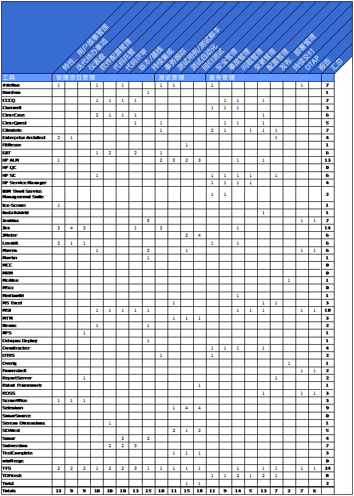

# 第六章 工具簇
## 6.1 简介
本章描述了应用、基础设施架构如何促成DevOps工具的选择。

## 6.2 术语
**工具簇**

工具簇是工具使用情况的概览。基于工具簇，我们可以分析工具缺失、冗余、多重功能等场景。使用工具簇的一个重要出发点，就是防止工具间低效协作引发DevOps团队功能缺失、质量蜕化。

**造或购**

维护工具簇，涉及确认研发还是购买一款工具。这并非一个非黑即白的选择，往往要在深度定制已购工具，或采购更贵、更多可用特性工具间做出选择。

**最佳组合/工具集成**

选择工具的关键要素是功能（工具提供最佳功能或相近功能），或关注由单个或多个工具联合覆盖全部功能需求。

## 6.3 概念
**生命周期管理**

工具如人，具有生命周期。加特纳技术成熟度曲线是分析工具位处生命周期何处的重要工具。因为新工具具备新技术、新洞见，启用市场上全新的工具往往带来优势。而位处曲线下降沿的工具则表示市场接受度低，不为用户采纳，或从市场上消失。这样的新工具往往缺乏稳定性，日渐增多的痛点有待消除。

## 6.4 最佳实践
### 6.4.1 所有权
工具簇必须有所有者。通常而言，每个DevOps团队都想声称是自己应用工具的所有者，因为团队必须承担这样的角色，也希望拥有自主能力。尽管开发人员或系统管理员都对某种工具存在偏好；但组织中的团队常常协同工作，比如DevOps交付链或者长期运营的大型开发项目。在这种场景下，DevOps团队使用相同的工具链变得较为重要。
因此，在工具簇中分层变得重要。第一层是通用工具，比如服务桌面工具、部署工具或调度工具，该层工具通常为架构层所（拥）有。这意味着所有团队都需要使用它们。第二层由一系列特定功能的工具组成，通常这些工具仅仅实现一部分特定功能，使用者需要做出选择。比如，一个团队会选择专用于Java应用的监控工具，而别的团队为了更好度量网络情况选择了另一款。基础架构必须保证这些工具配合良好，诸如将日志写入中心日志管理节点。最后，第三层由业务人员自由选择，作为工具簇的空位补缺。整体架构中，为改进、创新预留空间也很必要。

### 6.4.2 工具簇框架
观察工具的应用情况，对决定一个工具簇的完备性很重要。对于DevOps架构，你可以参照DevOps过程逐步核查（参加DevOps过程一章）。按过程中每一步的功能要求进行决策，建立度量去选择可用工具。表6-1给出了一个10个组织已识别出的监控功能。

| DevOps过程 | 功能 |
| --------- | ---- |
| 规划| 特性管理 产品代办清单 迭代代办清单 仪表盘 变更管理 |
| 编码| 软件配置管理 代码库 版本管理 基线 |
| 构建| 持续集成 |
| 测试| 事务跟踪 测试用例 测试脚本 回归测试 |
| 发布| 安全管理 |
| 部署| 发布部署管理 持续交付 研发-测试-准入-生产环境（DTAP） |
| 运营| 事故管理 问题管理 配置管理 |
| 监控| 报告 |

表6-1 DevOps工具功能

### 6.4.3 工具簇分析
图6-1给出了十个组织使用工具的总览视图，工具的数量着实可观，而且许多工具有一个以上的功能。

### 6.4.4 陷阱
**一桶到底**

对于DevOps过程尚不成熟的团队，工作往往是片段式的而非集成的，实际上往往选择最佳工具。然而，当过程越来越成熟，每阶段各步骤涉及越来越多的信息流通，自动化的需求同步增长。此时，往往工具间无法轻易贯通，甚至压根无法连接。因此，在市场中有一种使用集成解决方案的趋势，以期问题不再出现。此类集成工具的缺点在于单一领域延展性功能较少。通过观察单个工具提供了多少特性，在图6-1中比较容易识别哪些工具提供集成解决方案。为了做出好的选择，应关注过程中的各环节的显著功能。与此同时，依然会需要额外的工具或连接弥补空缺。

**本末倒置**

当DevOps团队每每遭遇问题进而选择工具时，常会落入巨大的陷阱。很多场景下，DevOps团队需要信息交流，却由于成本过高看似不可能达成。此时，往往标准化会成为更好的选择。研发人员和系统管理员像选择泰迪熊似的挑选工具，个性十足又钟爱有加。大量的时间被花在工具升级上，导致让他们感觉成为工具的所有者。其后果是这些工具不会被新的、更标准的功能替代。尽管市面上有更好、更标准的解决方案可行，它们会持续演进，纵横连接。

**造或购**

并非许多服务机构自行设计工具，而用户自研的工具和插件却很常见。根据界定，总有内容需要配置，总有必要实现连接。问题是消耗多少时间和精力，市面上是否存在既有集成解决方案。此外，由于仅一位专家能够保持工具运转，会产生员工职位保护。

图6-1 工具簇分析
