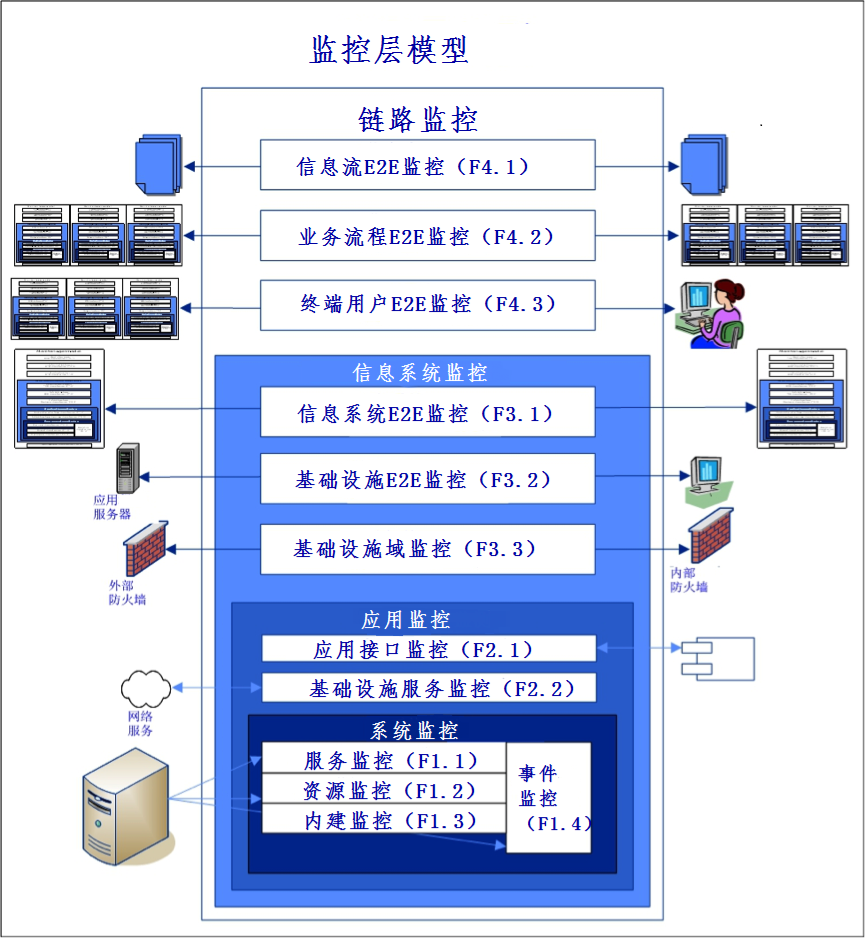

# 7. 监控
## 7.1 引言
本文描述了应用和基础设施架构如何影响DevOps监控工具的选择和使用。
## 7.2 术语
**监控分层模型**

有成千上万的监控工具，从中可以选择用于部署流水线和生产的监控。

**事件黑名单**

监控工具触发通知的事件被列入黑名单，这意味着当这些事件发生时，将会触发告警，运维团队随后便能采取相应措施。

**事件白名单**

无关的事件会列入白名单。

**误报**

应用引发异常的错误，而实际上该错误未发生。

**漏报**

应用没有在事件中触发错误，而实际上错误的情况已经发生。

##7.3 概念

监测分层模型

有成千上万的监控工具，从中可以选择用于部署流水线和生产的监控。

图7-1给出了可用于监控服务的各种监控功能概览。

图7-1， 监测分层模型[BEST 2015b]

F1. 系统监测（单元监控）

系统监控是监控分层模型的基础，对所有应用和基础设施单元进行度量。系统监控由于其单元层级的特性而有别于其它监控形式，因此系统监控也被称作单元监控。只有个别应用和基础设施组件不需要通过它来度量。系统监控对于基础设施的技术管理至关重要，系统监控由以下监控功能组成。

| F1.1    | 服务监控 | 同时监控基础设施服务和应用服务。这些服务通过一种管理协议来度量，通常使用简单网络管理协议（SNMP）。 | 
| ------ | ------ | ------ |
| F1.2 | 资源监控 |   监控资源表现形式上的某一单独组件，比如CPU，内存和网络带宽。   |
|F1.3 |   内建监控   |   内建监控是作为应用组成一部分的监控机制，它的价值在于可以度量应用运行态记录，而这在应用之外是不可见的。    |  
| F1.4 |   事件监控     |    事件监控包含了所有的基础设施组件和基础设施服务，以及应用事件。通常通过读取本地日志文件来获取事件，比如应用日志、安全日志和错误日志文件。    |    

表7-1，系统监控

F2. 应用监控

通过度量底层系统（系统监控）、基础设施服务和应用接口，应用监控为一个独立应用（子系统）或服务提供信息全景图。这一层对于应用管理而言很重要，它在一个视图中显示出了来自一个应用的所有相关信息。应用监控包含系统监控功能的同时，还具备如下监控功能。

| F2.1    | 应用接口监控 | 应用接口监控是特别为应用管理员们准备的，这样他们可以一目了然的确定应用正在按照预期运行。因此，很有必要的是，每个应用都需要明确哪些基础设施组件、基础设施服务和应用服务是重要的。另外，应用层会建立度量，检验基础设施和应用代码之间交互。 | 
| --------- | ------------------- | ------------------------------- |
| F2.2 | 基础设施服务监控 |   虽然一个基础设施服务可能是“在线的”，但并不意味着它在正常工作或者可访问。为了确定服务是否正常工作，需要在服务被调用的基础设施层运行动态测试。   |

表7-2，应用监控

F3:信息系统监控

需要多个应用实现一个用户功能，但这些应用往往不被用户单独识别。为了在信息系统层制定用户协议，在应用监控层之上，我们定义了信息系统监测层，本质上它是一系列的应用。度量一个端到端（E2E）信息系统，应尽可能从用户层面来开展监控，这些度量通常通过遍历业务路径来实现，因此这一级的监控又被称作业务监控。

E2E基础设施度量也被实现为支撑这一度量，E2E基础设施监控展示了基础设施各种组件间是否存在关联，在地理位置分离和具有更多逻辑网络（局域网（LAN）、广域网（WAN）等等）的大型计算中心尤其如此。信息系统监控在以下功能上作为应用监控的补充：

| F3.1    | 信息系统E2E监控 | 单个应用可用并不意味着用户可以正常使用，通常多个应用结合在一起才能完成整个链路（信息系统）。 | 
| --------- | ----------- | ------ |
| F3.2 | 基础设施E2E监控 |   E2E监控基础设施包含整个基础设施层的度量，这种监控通常应用于广域网（WAN）。   |
|F3.3 |  基础设施域监测   |   在具有多个供应商或网络被分割成单独的物理／逻辑域场景下，从可用性等考虑，需要单独监控这些域。相较于自动化办公网络，诸如隔离域（DMZ）可能采取其它标准。   |  

表7-3，信息系统监控

F4. 链路监控

链路监控旨在从不同的视角，反映整个链路的运行情况：

- 用户感知；
- 业务流程所需性能；
- 链路中的信息处理；

除了信息系统监控外，链路监控还包括以下功能。

| F4.1 | 信息流端到端监控   | 在这个水平上，识别了信息流监控。端到端的信息流度量方法，不是度量信息和通信技术服务，而是度量纯粹的业务处理信息流。 |
| ---- | ------------------ | ------------------------------------------------------------ |
| F4.2 | 业务流程端到端监控 | 基于相关的信息系统，这个功能度量了从前端到后台的业务流程。   |
| F4.3 | 最终用户端到端监控 | 在这个水平上，度量用户接受的服务。从最终用户的视角，展示提供的服务。 |

表7-4，链路监控

## 7.4 最佳实践

DevOps 流程包括“监控”阶段。监控服务是 DevOps 的基础。监控功能旨在监控服务的正常运转，提前发现一些问题。另外，监控服务能度量 SLA 标准。但是实现一个健全的监控服务，并不是一件易事。为了提供健全的监控能力，这篇文章会介绍 DevOps 流程中需要考虑什么。

### 7.4.1 监控原则

以下是一些适用于确保监控正确使用的原则。

| 监控功能 | 监控功能必须和 SLA 相一致。                        |
| -------- | -------------------------------------------------- |
| 相关性   | 除了端到端监控之外，也必须实现系统监控。           |
| 监控分类 | 对于要监控的每一类对象，尽可能使用相同的监控工具。 |

表7-5，监控原则

### 7.4.2 监控工具和 SLA

生产环境中监控工具的选择，依赖于 SLA 的内容。举个例子，如果 SLA 仅明确阐述了硬件平台和网络组件层面的运行指标和标准，那么对于 SLA 标准的监控，使用系统监控工具就能足够了。但是如果 SLA 描述了信息系统层面的运行指标，那么就需要调整监控，以适应其要求。

有些工具是将一个信息系统看作一组潜在对象的集合，将可用性、容量等定义为集合中的一个功能。其他的工具则监控信息系统本身，例如通过监控交易流。监控工具的功能和 SLA 标准的层级相匹配，才能提供一份可靠的 SLA 报告。

### 7.4.3 DevOps 流程

表7-6提供了和每个 DevOps 阶段以及监控功能相关的 DevOps 监控综览。之所以忽略了“运维”阶段，是因为没有可用的单元格了。

| **F#** | **监控功能**       | **计划** | **编码**      | **构建** | **测试**                       | **发布** | **监控** |
| ------ | ------------------ | -------- | ------------- | -------- | ------------------------------ | -------- | -------- |
| F1.1   | 服务监控           | 工具选择 | -             | -        | 系统测试                       | 部署     | 异常响应 |
| F1.2   | 资源监控           | 工具选择 | -             | -        | 系统测试                       | 部署     | 异常响应 |
| F1.3   | 内建监控           | -        | 开发监控      | 单元测试 | 系统测试                       | 部署     | 异常响应 |
| F1.4   | 事件监控           | 工具选择 | 开发异常      | 单元测试 | 系统测试                       | 部署     | 异常响应 |
| F2.1   | 应用接口监控       | -        | 开发异常      | -        | 集成测试                       | 部署     | 异常响应 |
| F2.2   | 基础设施服务监控   | 工具选择 | -             | -        | 系统测试                       | 部署     | 异常响应 |
| F3.1   | 信息系统端到端监控 | 工具监控 | 开发伪交易    | -        | 最终用户体验(EUX)测试(FAT/UAT) | 部署     | 异常响应 |
| F3.2   | 基础设施端到端监控 | 工具选择 | -             | -        | 基础设施端到端测试(PAT)        | 部署     | 异常响应 |
| F3.3   | 基础设施领域监控   | 工具选择 | -             | -        | 基础设施领域测试(PAT)          | 部署     | 异常响应 |
| F4.1   | 信息流端到端监控   | 工具选择 | 标签信息      | -        | 信息端到端测试(FAT/UAT)        | 部署     | 异常响应 |
| F4.2   | 业务流程端到端监控 | 工具选择 | 标签/状态信息 | -        | 业务端到端测试(FAT/UAT)        | 部署     | 异常响应 |
| F4.3   | 最终用户端到端监控 | 工具选择 | 标签信息      | -        | 真实用户监控(RUM)测试(FAT/UAT) | 部署     | 异常响应 |

表7-6, 每个 DevOps 阶段的监控功能.

**计划**

DevOps 的计划阶段必须将调整监控工具所需的成本和时间考虑其中。免费工具也需要时间来配置。通常会集中管理监控工具，一个新的敏捷项目能充分利用现有的工具。然而，内建监控和应用接口监控需要开发。这些都不得不在计划阶段就加入预算。

**编码**

在编码阶段，必须知道如何通过监控工具捕获异常。在日志文件中记录一个事件并不足够好。必须使用某种能被监控解释的事件格式。最简单的方法就是定义标准规则和指南(SRG)。标准必须满足，如果存在有效的理由，可以忽略规则，指南则是推荐使用。

编码过程中，以下最佳实践标准可以用来构建一个合适的监控工具：

- S1. 每个事件有个唯一编号。
- S2. 每个事件引用已经制定异常的软件配置项。
- S3. 每个事件有一个已分配的级别代码。
- S4. 每个事件也定义了恢复操作。
- S5. 每个新的事件会被注册到运维团队的产品待办事项列表。

在构建阶段，应该知道哪些监控功能是可用的。服务台和运维团队是参与其中的重要利益干系人。

以下方面在编码阶段非常重要：

- 内建监控的工具必须进行开发。重要的是，维护这些功能可能需要对应用进行新的部署。
- 事件监控要求在应用中正确的位置开发事件。最重要的位置就是执行和另一个模块、另一个应用或者基础设施服务进行外部调用的环节。
- 应用接口监控要求知道应用如何与其他应用通信。例如，实现对两个应用使用的通讯协议是否为相同版本的控制。
- 在只读/读写交易中，最好使用端到端信息系统监控(EUX，最终用户体验)。然而，对于读写交易，必须考虑在信息管理中这些交易不能产生脏数据。此时可以使用伪账户。无论如何，必须在整个应用中做到隔离，而且需要避免这样一个伪账户的滥用。
- 信息流端到端监控要求数据格式可以度量。这就意味着必须为信息项贴上标签。最好在编码阶段增加标签。
- 业务流程端到端监控。为了监控业务流程，应用必须标记信息，用以确定交易属于业务流程的哪一个部分。
- 终端用户端到端监控(RUM，真实用户监控)要求标记以确定哪个网络包会含有一种特殊类型的交易。

**构建**

在构建阶段，由于需要满足最长5分钟一次的构建过程，所以仅能使用单元测试。因此，完整的监控功能只能在稍后的部署流水线进行测试。这就意味着大部分监控功能直到交付阶段才能测试。所以在编码阶段，进行尽可能多的度量以避免缺陷的产生，是非常重要的。

构建必须检查异常编码的格式，他们应该符合基于源码检查的标准规则和指南(SRG)。在构建阶段，必须确认开发的每一个错误消息，已经记录在事件白名单或黑名单列表中了。

在编码阶段，程序员必须定义单元测试，在构建阶段将会使用这些单元测试，用来发现异常处理中的错误。所有误报和漏报都必须测试。

**测试**

只有在构建阶段创建了对象代码，在基线中检查了源代码之后，才有可能使用系统集成测试，以确认监控功能是否能在这个阶段发现异常。

通常认为，在部署流水线中的自动化验收测试仅需要涉及主逻辑。对此一个重要的例外，就是需要测试所有黑名单中异常的验收测试。

**发布**

一次成功的应用和基础设施组件的部署也应该含有监控功能调整的部署。否则，无法识别新的事件。部署一个监控工具的调整通常没那么令人兴奋。然而，监控工具调整的回归测试是一个挑战。在实际工作中，这方面花费的时间非常有限。造成的结果就是，监控功能通常不如原来预期的有效。

另外，如果自动化部署不成功，部署流水线中的脚本也应该含有异常。因此监控功能也必须监控部署流水线，关注的不仅是可用性，还有异常。

**运维**

维护系统的正常运行，通常意味着服务偏差的恢复。因此，运维团队在确定需要监控哪些方面的时候，是关键的利益干系人。通常可以自动地解决偏差。由于开发和运维团队的协作，让在此提供最大支持变为了可能。

**监控**

监控服务不仅对生产系统有用，而且适用于开发、测试、验收、生产环境（D-T-A-P）整个周期。一个不能忽视的重要事实就是，实际工作中使用了越来越多的监控工具。他们应该彼此很好地通信。这些工具间的协作会影响编码阶段的工作。这是因为监控工具的通信，通常是基于编码阶段事件开发的格式。
